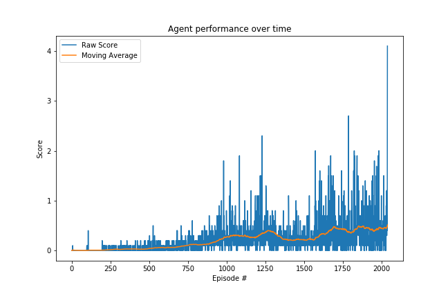

# Report
The following report contains details regarding the algorithm used to solve the environment, information about the agent performance, and ideas for follow-on work.

---

## Learning algorithm
The learning algorithm that was used to solve the environment was Deep Deterministic Policy Gradient (DDPG).
DDPG is an off-policy algorithm that supports continuous action spaces. It is often thought of as DQN for continuous action spaces.
The agent contains an Actor that selects the action to take and a Critic that assess the value of taking such an action.
We also use a target and local network to help stabilize learning, updating the target network on a regular interval.
At a high level, the agent interacts with the environment, collects experiences, and adds them to the replay buffer.
Every so often, the agent chooses to learn from it's experiences by sampling some set of the replay buffer and updating the Actor and Critic weights.
The agent then uses this updated model to continue interacting with the environment, retraining, interacting, etc. until the agent solves the environment.

The one modification made to DDPG for this multi-agent environment is that the observation and action spaces for both agents are concatenated and provided as inputs for each agent during learning.

The model architecture for the Actor and Critic networks is a fully-connected Dense neural network.
The input layer size is 48 (corresponding to the shared state space size).
We use a batch norm layer to normalize the minibatches of input.
The two Dense hidden layers are of size 256 and 128 respectively.
The output layer size is 2 (corresponding to the action space size) and 1 (corresponding to the value estimate).
The network uses ReLU non-linear activation functions for the hidden layers to capture the non-linear nature of the environment.
The output layer of the Actor uses a Tanh activation for the (-1, 1) action space constraint, and there is no activation layer on the output of the critic.

The hyperparameters used during training are as follows:
* Replay Buffer size: 100000 experiences
* Batch size: 128
* Gamma (discount factor): 0.99
* Tau (soft update weight for target Q network): 0.008
* Learning rate (Actor and Critic): 0.001
* Update every (how often to retrain the target network): 1 step
* Number of learning passes: 5

In general, I was able to reuse a lot of material from the DDPG lab in the Udacity Reinforcement Learning Nanodegree curriculum as well as Project 2, making alterations to the model, agent, replay buffer, and DDPG functionality to fit the Unity environment and the multi-agent nature of the progject.

## Plot of rewards

The plot below shows the agent's learning progress over time.

From above we can see that agent learning improves steadily over time until we reach an average reward of +0.5 for the last 100 episodes at episode 2038.

## Ideas for future work

Some concrete ideas for improving the agent's performance are:

* Different policy gradient algorithm: Other alternatives to DDPG like A3C or SAC could potentially lead to better learning performance.

* Automatic hyperparameter tuning: I went through a few different iterations of hyperparameter tuning manually. However, this is not feasible at the scale needed to truly identify the optimal hyperparameters, so setting up a framework to truly perform large-scale automated hyperparameter tuning would allow us to find the best configuration to solve the environment.

* Prioritized replay sampling: The sampling used was uniformly random from the replay buffer, which treats all experiences equally. We know that this isn't always the case, as certain experiences lead to better learning performance. Adding prioritized replay sampling should lead to faster agent learning.

* Changing the DDPG Network architecture: The neural network architecture used for the Actor and Critic was fairly simple. It's possible that adding more layers or increasing the size of each layer would increase the agent's capacity to learn, which might take longer to train initially, but with the correct learning parameters, could lead to solving the environment faster.

* Training the agents with their own observation spaces only: This would be a version of partial information, meaning that one agent wouldn't have access or insight into the other agents observation space. This would make training more difficult potentially, but would be more representative of what is likely to occur in more real-world environments.
